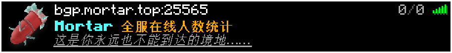

# Mortar Daemon

## 简介

MD是一个轻量化的伪造的MineCraft服务端应用，利用LSP协议达成对客户端的各种显示效果。  
  
您只需要简单的修改JSON信息即可创建一个高度自定义的状态信息！

``` JSON
{
  "players": {
    "max": -300,
    "online": -300
  }
}
```  

***修改后***：
  

## 一键安装

为了简化安装过程，特别提供了一键安装脚本，适用于Windows和Linux系统。请根据您的操作系统执行相应的命令。

### Windows

在Windows系统中，您可以通过运行以下PowerShell命令来启动安装过程：

```powershell
Invoke-WebRequest -Uri "https://raw.githubusercontent.com/MortarHQ/Mortar-Daemon/master/docs/scripts/install.bat" -OutFile "install.bat"; .\install.bat
```

这条命令会自动从项目仓库下载安装脚本并立即执行它。

### Linux

在Linux系统中，您可以使用以下命令来一键安装：

```bash
curl -sL https://raw.githubusercontent.com/MortarHQ/Mortar-Daemon/master/docs/scripts/install.sh > install.sh && bash install.sh
```

这条命令会从您的项目仓库下载安装脚本并立即执行它。

**注意**：出于安全考虑，运行来自互联网的脚本之前，请确保您已经审核了脚本的内容。

## 主要技术栈

- **Express**: 用于构建服务器端的 Web 应用
- **TypeScript**: `JavaScript` 的一个超集，增加了类型系统
- **Concurrently**: 用于同时运行多个命令
- **Dotenv**: 用于从 `.env` 文件加载环境变量
- **LSP**: `MineCraft` 服务器状态获取协议

## 项目结构

- `app.ts` 和 `appServer.ts`: 应用程序和服务器端逻辑的主要入口点。
- `test.json` 和 `test.ts`: 用于测试目的的文件。
- `config` 目录: 包含应用程序配置设置的 `default.ts` 文件。
- `middleware` 目录: 包含中间件函数的 TypeScript 文件。
- `public` 目录: 包含静态资源，如主要的 HTML 和 CSS 文件。
- `routes` 目录: 包含与路由和服务器端逻辑相关的 TypeScript 文件。
- `utils` 目录: 包含实用函数和类。

## 安装与运行

### 安装依赖

在项目根目录下运行以下命令安装依赖：

```bash
npm install
```

### 开发模式

要在开发模式下运行前端和守护进程，请执行：

```bash
npm run dev
```

### 生产模式

要在生产模式下运行前端和守护进程，请执行：

```bash
npm start
```

### 测试

要运行项目的测试，请执行：

```bash
npm test
```

## 配置

项目的配置主要通过两种方式进行管理：

1. **配置文件**：项目的配置文件位于 `config` 目录下的 `default.ts` 中。您可以根据需要修改这些配置，以适应不同的环境和需求。

2. **环境变量**：为了更好地管理敏感信息和提高配置的灵活性，项目还支持通过 `.env` 文件来设置环境变量。`.env` 文件应该位于项目的根目录下，您可以在其中定义如数据库连接信息、API 密钥等敏感或环境特定的配置项。

   使用 `.env` 文件的步骤如下：
   - 在项目根目录下创建一个 `.env` 文件。
   - 在 `.env` 文件中添加需要的环境变量，格式为 `KEY=VALUE`。例如：

        ```
        PORT=8080
        HOST=localhost
        LOGLEVEL=info
        LOGFORMAT=combined
        SERVERPORT=25565
        ```

   - 现在，您可以在项目中通过 `process.env` 对象访问这些环境变量了。

3. **监测服务器配置**：项目的配置文件位于 `config` 目录下的 `minecraft.ts` 中。您可以根据需要修改这些配置，以监测不同的服务器人数。

```
{  
    host: "fun.mortar.top",  //需要监听人数的服务器地址
    port: "24445",  //需要监听人数的服务器的端口号
    version: "1.16.5", //需要监听人数的服务器的版本
},
```

## 使用方式

本 web 控制台提供了一个直观的界面，用于管理和监控 Minecraft 服务器的状态。以下是如何使用此控制台的步骤：

1. **访问控制台**：在浏览器中输入部署此应用的服务器地址，即可访问 web 控制台。

2. **编辑偏移值**：在控制台的偏移区域，您可以直接编辑当前的偏移值（`offset`）。该值以 JSON 格式展示，确保您输入的是有效的 JSON 数据。

3. **提交偏移值**：编辑完成后，点击“提交偏移”按钮以更新服务器上的偏移值。如果输入的数据格式不正确，将收到“不符合json文本！”的错误提示。如果数据未发生变化，将提示“没有发生变化”。

4. **重置偏移值**：若需撤销对偏移值的更改，点击“重置偏移”按钮。系统将恢复到您最近一次提交的偏移值。

5. **查看服务器列表**：控制台还展示了当前的服务器列表（`serverList`），以 JSON 格式呈现，让您能够快速查看当前伪造的服务器状态。

通过这个控制台，用户可以轻松地管理 Minecraft 服务器的偏移值和查看服务器状态，实现对服务器状态的实时监控和调整。

## 贡献

欢迎通过 Pull Requests 或 Issues 来贡献您的代码或提出您的建议。

## 许可信息

[待添加]

---

感谢您对本项目的关注，希望它能帮助您更好地了解和使用Minecraft List Ping协议
